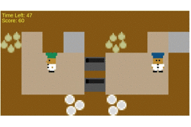
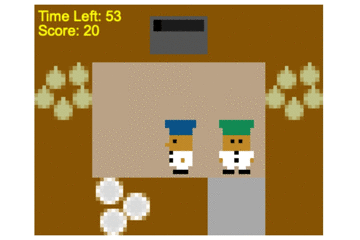

# PECAN
<p align="center">
  
  <br>
  <i>(A picture of PECAN created by DALL·E)</i>
</p>
This codebase is implementation of the AAMAS 2023 paper [PECAN: Leveraging Policy Ensemble for Context-Aware Zero-Shot Human-AI Coordination](https://arxiv.org/abs/2301.06387). 

This codebase is based on [human-aware-rl](https://github.com/HumanCompatibleAI/human_aware_rl/tree/neurips2019) and [MEP](https://github.com/ruizhaogit/maximum_entropy_population_based_training.git).
<p align="center">
  
  
  <br>
</p>

We provide an easy-to-use human-AI coordination framework for the Overcooked environment. Please check this [repo](https://github.com/LxzGordon/pecan_human_AI_coordination) for further details.
# Instruction for usage

## 1. Install
Install relavant modules and the human-aware-rl package by
 ```shell
    cd human-aware-rl/
    ./install.sh
```

## 2. Stage 1&2 (Train the population and context encoder. Optional)
Follow the instructions of the first step of [MEP](https://github.com/ruizhaogit/maximum_entropy_population_based_training.git) to train an maximum-entropy population.

Train the context encoder in [here](https://github.com/LxzGordon/PECAN/blob/master/human_aware_rl/human_aware_rl/context/model.py) via standard supervised learning with data collected in the stage 2 training of MEP.

For easy usage, some pre-trained models are provided in this repo so you can skip this step.
## 3. Train the ego agent
Train the ego agent with the following comman. Note that you have to specificy paths of all 15 agents in the population in the  ```LOAD_FOLDER_LST``` variable, seperated by  ```:```.
 ```shell
 cd human-aware-rl/human-aware-rl
export PBT_DATA_DIR=pbt_data_dir_2/ && python pbt/pbt_model_pool.py with fixed_mdp layout_name="simple"\
EX_NAME="pbt_simple" TOTAL_STEPS_PER_AGENT=1.1e7 TRAINING_ITERATIONS=$training_iteration ALPHA_DECAY_HORIZON=$alpha_horizon ALPHA_FINAL=$alpha_final REW_SHAPING_HORIZON=$reward_shaping\
LR=$lr POPULATION_SIZE=15 SEEDS="[$seeds]" GPU_ID=0 NUM_SELECTION_GAMES=$number_sel_games VF_COEF=$vf_coef MINIBATCHES=$minibatches\
TIMESTAMP_DIR=False ENTROPY_POOL=$entropy_pool PRIORITIZED_SAMPLING=True ALPHA=$alpha METRIC=1.0\
LOAD_FOLDER_LST="path1/:path2/:path3/..." 
 ```
 
An example with the pre-trained models:
 ```shell
export PBT_DATA_DIR=pbt_data_dir_2/ && python pbt/pbt_model_pool.py with fixed_mdp layout_name="simple"\
EX_NAME="pbt_simple" TOTAL_STEPS_PER_AGENT=1.1e7 TRAING_ITERATIONS=100 ALPHA_DECAY_HORIZON=70 \
ALPHA_FINAL=0.3 REW_SHAPING_HORIZON=5e6 LR=8e-4 POPULATION_SIZE=15 SEEDS="[1111,5015,7015,8015]" GPU_ID=0\
NUM_SELECTION_GAMES=6 VF_COEF=0.5 MINIBATCHES=10 TIMESTAMP_DIR=False ENTROPY_POOL=0.0\
PRIORITIZED_SAMPLING=True ALPHA=3.0 METRIC=1.0\ LOAD_FOLDER_LST="pbt_data_dir/pbt_simple/seed_9015/agent0/pbt_iter1/:pbt_data_dir/pbt_simple/seed_9015/agent1/pbt_iter1/:pbt_data_dir/pbt_simple/seed_9015/agent2/pbt_iter1/:pbt_data_dir/pbt_simple/seed_9015/agent3/pbt_iter1/:pbt_data_dir/pbt_simple/seed_9015/agent4/pbt_iter1/:pbt_data_dir/pbt_simple/seed_9015/agent0/pbt_iter152/:pbt_data_dir/pbt_simple/seed_9015/agent1/pbt_iter152/:pbt_data_dir/pbt_simple/seed_9015/agent2/pbt_iter152/:pbt_data_dir/pbt_simple/seed_9015/agent3/pbt_iter152/:pbt_data_dir/pbt_simple/seed_9015/agent4/pbt_iter152/:pbt_data_dir/pbt_simple/seed_9015/agent0/pbt_iter305/:pbt_data_dir/pbt_simple/seed_9015/agent1/pbt_iter305/:pbt_data_dir/pbt_simple/seed_9015/agent2/pbt_iter305/:pbt_data_dir/pbt_simple/seed_9015/agent3/pbt_iter305/:pbt_data_dir/pbt_simple/seed_9015/agent4/pbt_iter305/"
 ```
 
# Citation
Please cite
 ```
@article{lou2023pecan,
  title={PECAN: Leveraging Policy Ensemble for Context-Aware Zero-Shot Human-AI Coordination},
  author={Lou, Xingzhou and Guo, Jiaxian and Zhang, Junge and Wang, Jun and Huang, Kaiqi and Du, Yali},
  journal={arXiv preprint arXiv:2301.06387},
  year={2023}
}
 ```
